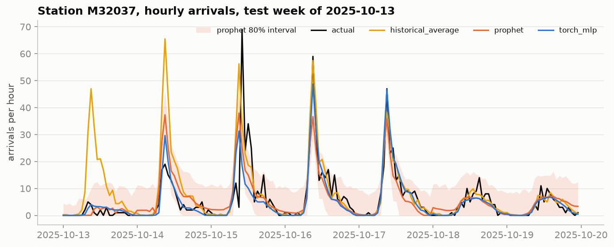
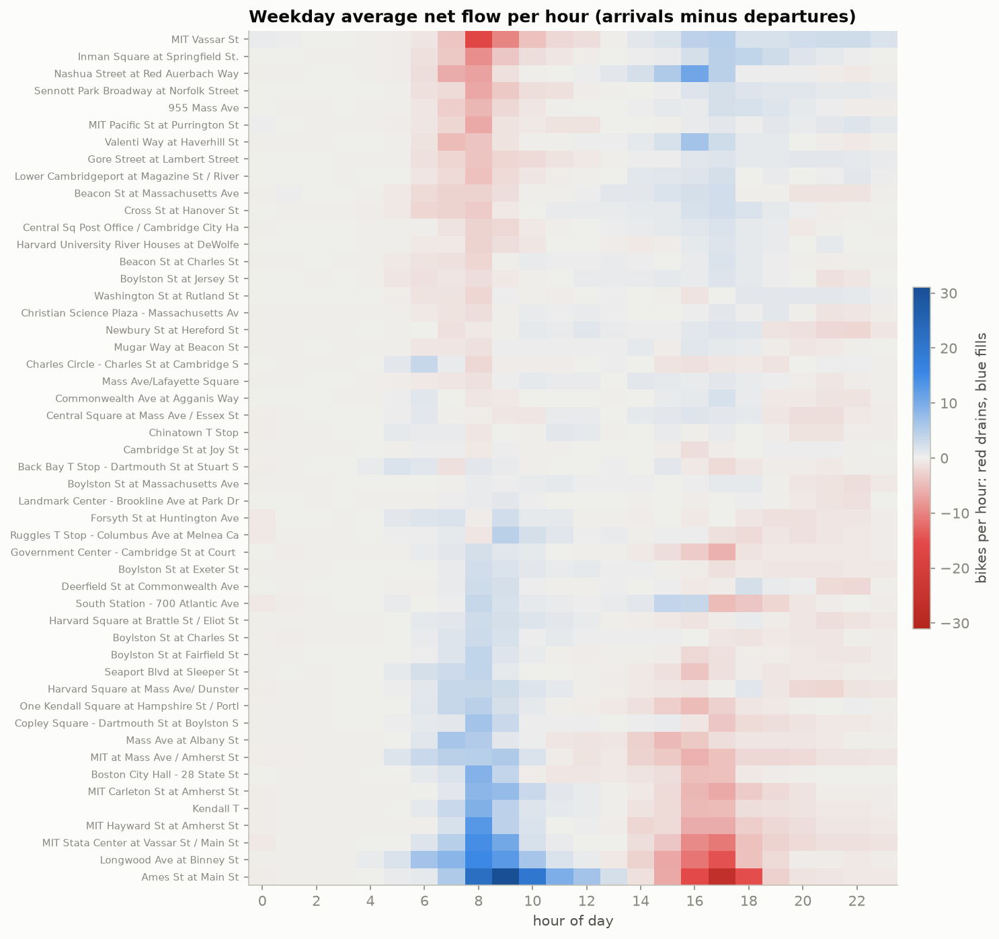

# BikeCast

**Can we forecast tomorrow's hourly bike pickups and dropoffs at Boston's busiest Bluebikes stations
well enough to plan rebalancing, and which kind of model does it best?**

Bike share operators move bikes by truck so stations don't run empty or full. Knowing tomorrow's demand
by hour lets them plan the night before. BikeCast forecasts departures and arrivals for each of the 50
busiest stations for all 24 hours of the next day, compares four models on a rolling backtest, and ends
with one operational takeaway.

All numbers in the results sections below are copied by code from
[`reports/results.md`](reports/results.md) and [`reports/rebalancing.md`](reports/rebalancing.md),
which are generated from the backtest. A test fails if this README drifts from them.

## Key findings

- A **global PyTorch MLP** (one network for all 50 stations, with a learned station embedding) is the
  best station-level model. It beats the strongest baseline at every one of the 50 stations, with its
  largest gains on rainy days and holidays.
- **Prophet** barely beats a simple 8-week average at station level but is the best model for
  system-wide totals. Its 80% intervals are calibrated overall but far too wide at night and too narrow
  at the evening peak.
- The biggest forecast misses are **crowd events** (the Head of the Charles Regatta weekend, Boston
  Marathon weekend), not weather. No model has an event feature.
- A small set of stations drain or fill **every weekday morning**: residential and dorm stations
  empty out while Kendall Square and the Longwood medical area fill up.

## Data

- **Trips**: Bluebikes trip history, January 2024 to September 2026, from the public bucket linked on
  the [Bluebikes System Data page](https://bluebikes.com/system-data). About 12.9 million trips after
  cleaning.
- **Weather**: hourly temperature, precipitation, and wind for Boston from
  [Open-Meteo](https://open-meteo.com). Models use **archived weather forecasts** (what was predicted at
  the time), not observed weather.
- **Calendar**: US and Massachusetts holidays (including Patriots' Day) and an approximate
  university-semester flag.

Cleaning rules, the station crosswalk (8 ID merges), and every other data decision are logged in
[`docs/DECISIONS.md`](docs/DECISIONS.md), with row counts removed by each rule.

## Method

1. **Pipeline**: download and clean one month at a time, build a station crosswalk, then aggregate to
   hourly departures and arrivals per station with DuckDB, with explicit zero rows for empty hours.
2. **Closures**: a station with no trips for 48+ hours (winter removals, Marathon street closures) is
   marked out of service. Those hours are not scored, because predicting 0 for a closed station is
   trivial. The flag is never a model input.
3. **Backtest**: 10 test weeks spread across seasons. Each day is forecast at midnight using only data
   from before that day. Models are fit on data before each test week; the MLP's early stopping uses
   the 14 days before that. A leakage test corrupts all future data and checks that no forecast moves.
4. **Models**:
   - *Seasonal naive*: same station and hour, one week earlier.
   - *Historical average*: mean of the same station, weekday, and hour over the last 8 weeks.
   - *Prophet*: one model per station per target, with separate daily curves for working days and
     weekends/holidays, holidays, and weather regressors.
   - *Global MLP (PyTorch)*: one network across all stations. Inputs are demand lags (24h, 48h, 168h),
     rolling means, calendar, forecast weather, and a station embedding; output is all 24 hours of the
     next day.
5. **Metrics**: MAE in bikes per station-hour (main), RMSE, WAPE (total error over total demand,
   because MAPE breaks on the many zero hours), and skill = 1 - MAE / baseline MAE.

## Results

<!-- BEGIN results:station -->
| model | target | MAE | RMSE | WAPE | skill | skill vs hist avg |
|---|---|---|---|---|---|---|
| seasonal_naive | arrivals | 2.313 | 3.889 | 63.2% | +0.0% | -22.5% |
| historical_average | arrivals | 1.888 | 3.139 | 51.6% | +18.4% | +0.0% |
| prophet | arrivals | 1.859 | 2.896 | 50.8% | +19.6% | +1.6% |
| torch_mlp | arrivals | 1.666 | 2.746 | 45.5% | +28.0% | +11.8% |
| seasonal_naive | departures | 2.334 | 3.914 | 63.9% | +0.0% | -23.4% |
| historical_average | departures | 1.891 | 3.150 | 51.8% | +19.0% | +0.0% |
| prophet | departures | 1.866 | 2.880 | 51.1% | +20.0% | +1.3% |
| torch_mlp | departures | 1.661 | 2.743 | 45.5% | +28.8% | +12.2% |
<!-- END results:station -->

**Per station**: skill measured at each station separately.

<!-- BEGIN results:per_station -->
Skill computed separately at each station, departures and arrivals pooled.

| model | stations better than hist avg | median skill | lowest | highest |
|---|---|---|---|---|
| seasonal_naive | 0 of 50 | -23.4% | -30.6% | -14.6% |
| prophet | 36 of 50 | +2.3% | -19.1% | +11.3% |
| torch_mlp | 50 of 50 | +10.6% | +5.3% | +22.5% |
<!-- END results:per_station -->

**System-wide hourly totals** (the global MLP is a station-level model and is not run here):

<!-- BEGIN results:system -->
| model | target | MAE | RMSE | WAPE | skill | skill vs hist avg |
|---|---|---|---|---|---|---|
| seasonal_naive | arrivals | 162.156 | 303.252 | 27.5% | +0.0% | -5.4% |
| historical_average | arrivals | 153.822 | 252.314 | 26.1% | +5.1% | +0.0% |
| prophet | arrivals | 146.365 | 200.655 | 24.8% | +9.7% | +4.8% |
| seasonal_naive | departures | 163.156 | 305.599 | 27.6% | +0.0% | -6.0% |
| historical_average | departures | 153.850 | 254.111 | 26.0% | +5.7% | +0.0% |
| prophet | departures | 147.947 | 203.898 | 25.0% | +9.3% | +3.8% |
<!-- END results:system -->


**A week at one station.** Monday 2025-10-13 was Columbus Day. The historical average forecasts a
normal commute peak at Ames St (Kendall) that never comes; Prophet and the MLP know it's a holiday.



**How much does forecast vs actual weather matter?**

<!-- BEGIN results:sensitivity -->
Headline results use archived weather forecasts, which is what an operator would have. Rerunning with actual (observed) weather shows how much better the model would look with perfect weather knowledge.

| model | MAE with forecast weather | MAE with actual weather | difference |
|---|---|---|---|
| torch_mlp | 1.664 | 1.639 | -1.5% |
<!-- END results:sensitivity -->

Full breakdowns (by season, weekday vs weekend, rain vs dry, hour, and Prophet interval coverage) are in
[`reports/results.md`](reports/results.md). Error analysis, including the worst days for each model, is
in [`notebooks/03_error_analysis.ipynb`](notebooks/03_error_analysis.ipynb).

## Rebalancing takeaway

<!-- BEGIN rebalancing:summary -->
On a typical weekday morning (7 to 10am), **9 of the 50 busiest stations reliably drain**, losing a combined **114 bikes** by forecast (126 actually), and **13 reliably fill**, gaining a combined **263 bikes** by forecast (278 actually). Restocking the draining stations before 7am, and clearing docks at the filling ones, targets the flows that repeat every weekday.

On 98% of mornings a station flagged as draining really did lose bikes (88% lost more than 5). For filling stations the rates are 99% and 93%.

These morning patterns are very regular. The historical average baseline flags 8 of the same 9 draining stations and 13 of the same 13 filling stations, so the list itself does not need a learned model. What the forecast adds is the day-specific amount, where the MLP is 12% more accurate than the historical average across all station-hours (results.md), with the biggest gains on holidays and rainy days.
<!-- END rebalancing:summary -->

<!-- BEGIN rebalancing:drains -->
| station | name | weekdays | forecast share | actual share | median forecast | median actual |
|---|---|---|---|---|---|---|
| M32042 | MIT Vassar St | 48 | 100% | 100% | -27.0 | -33.0 |
| M32062 | Inman Square at Springfield St. | 48 | 100% | 100% | -14.8 | -17.0 |
| M32041 | MIT Pacific St at Purrington St | 48 | 100% | 90% | -13.2 | -12.0 |
| A32025 | Nashua Street at Red Auerbach Way | 48 | 98% | 88% | -12.5 | -13.0 |
| M32081 | Gore Street at Lambert Street | 48 | 98% | 79% | -11.2 | -10.5 |
| M32063 | Sennott Park Broadway at Norfolk Street | 48 | 92% | 94% | -10.9 | -12.5 |
| B32016 | Beacon St at Massachusetts Ave | 43 | 91% | 79% | -8.5 | -9.0 |
| A32053 | Valenti Way at Haverhill St | 48 | 81% | 75% | -8.3 | -10.0 |
| M32073 | 955 Mass Ave | 48 | 85% | 83% | -7.6 | -9.5 |
<!-- END rebalancing:drains -->

Stations that fill, and the method, are in [`reports/rebalancing.md`](reports/rebalancing.md).



## Limitations

- **Weather forecasts are slightly too good.** Open-Meteo's archived forecasts are stitched from the
  first hours of each model run, so they are somewhat more accurate than a true next-day forecast.
  Results are a little optimistic, though the sensitivity check above suggests the effect is small.
- **Flows, not inventory.** Trip data has no dock counts or starting stock. The rebalancing numbers are
  how many bikes the morning flow moves, not a truck schedule.
- **No event calendar.** Regattas, marathons, and concerts cause the largest misses.
- **Prophet's yearly seasonality** is under-identified for test weeks with less than two years of
  history. It was kept as planned rather than changed after seeing test results.
- **Scope**: top 50 stations (about a third of trip ends), 10 test weeks, one city.

## Dashboard

```bash
make app
```

A Streamlit app (map of forecast net flow, station-level forecast vs actual with Prophet's interval,
model comparison, and a rebalancing list for any backtest day). It reads a small committed snapshot in
`reports/app_data/`, so it works right after cloning.

## Reproduce

Requires Python 3.12 and [uv](https://docs.astral.sh/uv/). No API keys. About 40 minutes on a laptop,
most of it Prophet; peak disk use is about 2 GB.

```bash
git clone https://github.com/jasonlam11/bikecast && cd bikecast
uv sync
make all     # data, features, backtest, rebalancing, snapshot, readme
make test
```

`make all` downloads the trip data month by month, keeping only cleaned Parquet, and should regenerate
`reports/results.md` exactly. Individual steps: `make data`, `make features`, `make backtest`,
`make rebalancing`, `make eda`, `make error-analysis`, `make snapshot`, `make readme`.

## Repo layout

```
src/bikecast/
  data/         download, clean, stations (crosswalk), aggregate, weather, calendar
  features/     day-ahead feature table
  models/       baselines, Prophet, PyTorch global MLP
  evaluation/   backtest, metrics, report, analysis, rebalancing, snapshot, readme
  dashboard.py  data functions for the app
notebooks/      01_eda.ipynb, 03_error_analysis.ipynb
app/            streamlit_app.py
reports/        results.md, rebalancing.md, figures/, app_data/ (all generated)
tests/          pytest suite, including leakage and zero-fill tests
docs/           PLAN.md, DECISIONS.md
```
