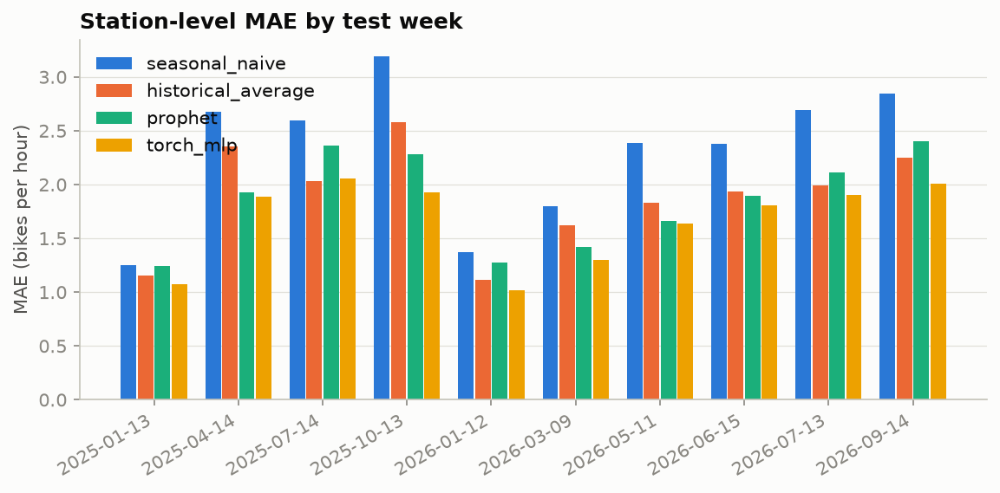
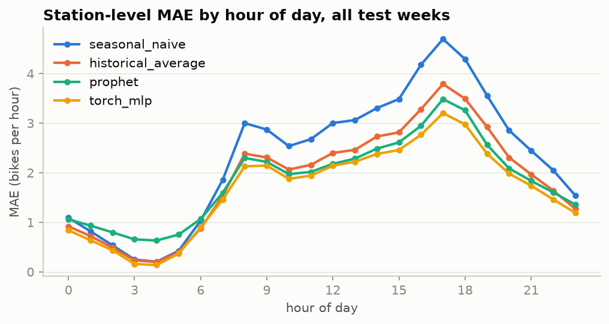

# BikeCast results

_Generated by `src/bikecast/evaluation/report.py`. Do not edit by hand._

## Setup

- Rolling-origin backtest over 10 test weeks (Monday to Sunday): 2025-01-13, 2025-04-14, 2025-07-14, 2025-10-13, 2026-01-12, 2026-03-09, 2026-05-11, 2026-06-15, 2026-07-13, 2026-09-14.
- Each day is forecast at midnight for all 24 hours, using only data from before that day.
- Station level: the 50 busiest stations (ranked on 2024).
- Out-of-service station-hours are not scored: 2,386 of 168,000 station-hour-target rows in the test weeks.
- Skill = 1 - MAE / seasonal naive MAE on the same rows. Positive means better than the baseline. Skill vs hist avg uses the historical average baseline instead, which is the stronger of the two.

## Station level (per station-hour)

| model | target | MAE | RMSE | WAPE | skill | skill vs hist avg |
|---|---|---|---|---|---|---|
| seasonal_naive | arrivals | 2.313 | 3.889 | 63.2% | +0.0% | -22.5% |
| historical_average | arrivals | 1.888 | 3.139 | 51.6% | +18.4% | +0.0% |
| prophet | arrivals | 1.859 | 2.896 | 50.8% | +19.6% | +1.6% |
| torch_mlp | arrivals | 1.666 | 2.746 | 45.5% | +28.0% | +11.8% |
| seasonal_naive | departures | 2.334 | 3.914 | 63.9% | +0.0% | -23.4% |
| historical_average | departures | 1.891 | 3.150 | 51.8% | +19.0% | +0.0% |
| prophet | departures | 1.866 | 2.880 | 51.1% | +20.0% | +1.3% |
| torch_mlp | departures | 1.661 | 2.743 | 45.5% | +28.8% | +12.2% |

## System-wide (hourly totals across all stations)

| model | target | MAE | RMSE | WAPE | skill | skill vs hist avg |
|---|---|---|---|---|---|---|
| seasonal_naive | arrivals | 162.156 | 303.252 | 27.5% | +0.0% | -5.4% |
| historical_average | arrivals | 153.822 | 252.314 | 26.1% | +5.1% | +0.0% |
| prophet | arrivals | 146.365 | 200.655 | 24.8% | +9.7% | +4.8% |
| seasonal_naive | departures | 163.156 | 305.599 | 27.6% | +0.0% | -6.0% |
| historical_average | departures | 153.850 | 254.111 | 26.0% | +5.7% | +0.0% |
| prophet | departures | 147.947 | 203.898 | 25.0% | +9.3% | +3.8% |

## Station-level MAE by test week (departures and arrivals pooled)

| test week | seasonal_naive | historical_average | prophet | torch_mlp |
|---|---|---|---|---|
| 2025-01-13 | 1.254 | 1.152 | 1.245 | 1.072 |
| 2025-04-14 | 2.676 | 2.358 | 1.926 | 1.887 |
| 2025-07-14 | 2.595 | 2.034 | 2.360 | 2.056 |
| 2025-10-13 | 3.189 | 2.580 | 2.279 | 1.926 |
| 2026-01-12 | 1.373 | 1.116 | 1.278 | 1.018 |
| 2026-03-09 | 1.796 | 1.623 | 1.421 | 1.297 |
| 2026-05-11 | 2.388 | 1.831 | 1.661 | 1.635 |
| 2026-06-15 | 2.379 | 1.937 | 1.898 | 1.806 |
| 2026-07-13 | 2.692 | 1.992 | 2.111 | 1.899 |
| 2026-09-14 | 2.844 | 2.250 | 2.405 | 2.010 |

## Station-level breakdowns (MAE, both targets pooled)

### Season

| season | seasonal_naive | historical_average | prophet | torch_mlp |
|---|---|---|---|---|
| fall | 3.016 | 2.415 | 2.342 | 1.968 |
| spring | 2.283 | 1.931 | 1.666 | 1.604 |
| summer | 2.555 | 1.988 | 2.123 | 1.920 |
| winter | 1.314 | 1.134 | 1.262 | 1.045 |

### Weekday vs weekend

| day_type | seasonal_naive | historical_average | prophet | torch_mlp |
|---|---|---|---|---|
| weekday | 2.275 | 1.872 | 1.835 | 1.621 |
| weekend | 2.444 | 1.935 | 1.930 | 1.770 |

### Rain vs dry (actual daily precipitation >= 1 mm)

| weather | seasonal_naive | historical_average | prophet | torch_mlp |
|---|---|---|---|---|
| dry | 2.264 | 1.853 | 1.838 | 1.689 |
| rainy | 2.454 | 1.969 | 1.916 | 1.608 |

### Hour of day

| hour_band | seasonal_naive | historical_average | prophet | torch_mlp |
|---|---|---|---|---|
| night 0-5 | 0.553 | 0.492 | 0.805 | 0.430 |
| am peak 6-9 | 2.190 | 1.775 | 1.795 | 1.658 |
| midday 10-15 | 3.012 | 2.438 | 2.259 | 2.170 |
| pm peak 16-19 | 4.182 | 3.372 | 3.064 | 2.832 |
| evening 20-23 | 2.224 | 1.797 | 1.722 | 1.594 |

## 80% prediction interval coverage

Share of actuals inside the model's 80% interval. Well calibrated is about 80%.

| model | group | coverage | mean width (bikes) | n |
|---|---|---|---|---|
| prophet | all | 84.9% | 5.75 | 165,614 |
| prophet | target: arrivals | 84.8% | 5.72 | 82,807 |
| prophet | target: departures | 85.0% | 5.79 | 82,807 |
| prophet | season: fall | 80.3% | 6.31 | 33,600 |
| prophet | season: spring | 86.9% | 5.67 | 49,142 |
| prophet | season: summer | 82.1% | 6.19 | 50,280 |
| prophet | season: winter | 90.8% | 4.63 | 32,592 |
| prophet | hours: night 0-5 | 98.0% | 3.98 | 41,424 |
| prophet | hours: am peak 6-9 | 86.5% | 5.73 | 27,616 |
| prophet | hours: midday 10-15 | 80.5% | 6.70 | 41,390 |
| prophet | hours: pm peak 16-19 | 66.8% | 6.99 | 27,592 |
| prophet | hours: evening 20-23 | 88.3% | 5.78 | 27,592 |

## Sensitivity: forecast weather vs actual weather

Headline results use archived weather forecasts, which is what an operator would have. Rerunning with actual (observed) weather shows how much better the model would look with perfect weather knowledge.

| model | MAE with forecast weather | MAE with actual weather | difference |
|---|---|---|---|
| torch_mlp | 1.664 | 1.639 | -1.5% |
